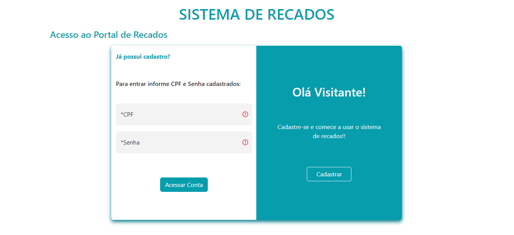
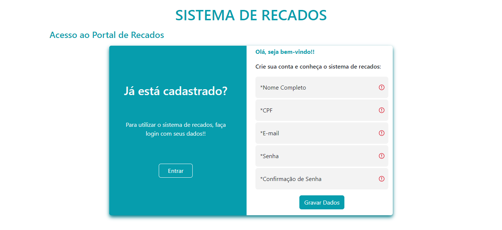
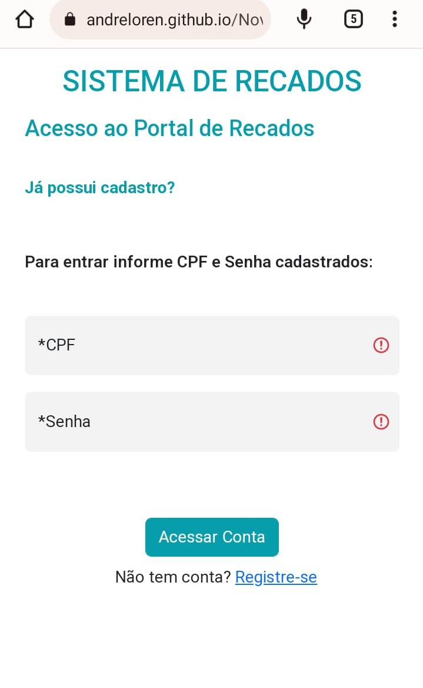
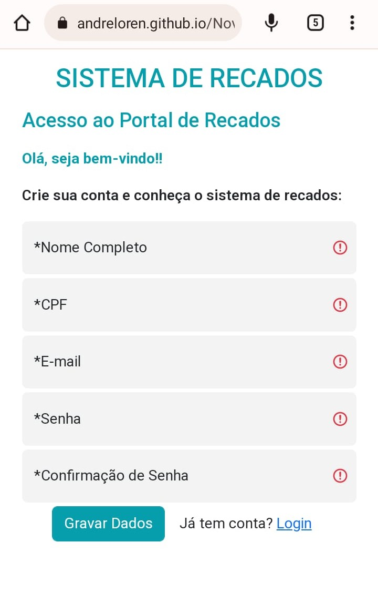

<h1 align="center"> Projeto Sistema de Recados </h1>

Projeto Final de Módulo - Growdev

  <a href="#-tecnologias">Tecnologias</a>&nbsp;&nbsp;&nbsp;|&nbsp;&nbsp;&nbsp;
  <a href="#-projeto">Projeto</a>&nbsp;&nbsp;&nbsp;|&nbsp;&nbsp;&nbsp;
  <a href="#-sistema">Sistema</a>&nbsp;&nbsp;&nbsp;|&nbsp;&nbsp;&nbsp;

 

  

  

  

  

## 🚀 Tecnologias

Esse projeto foi desenvolvido com as seguintes tecnologias:

- HTML e CSS com Animation
- JavaScript, Typescript e JSON
- [Bootstrap](https://getbootstrap.com/)
- [Node e NPM](https://nodejs.org/)

## 💻 Projeto

O Sistema de Recados é uma simulação de sistema CRUD que armazena dados no Local Storagem, com páginas de Login, Cadastro e Recados. Podendo cadastrar multiplos usuários, bem como incluir,editar e excluir uma lista de recados.

## 📓 Sistema

Você pode acessar o projeto através [DESSE LINK](https://andreloren.github.io/Novo_Sistema_Recados/). Sistema pode ser acessado via Desktop ou Mobile.
